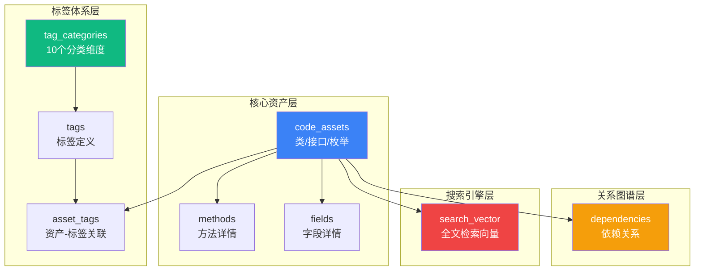

# Redisson 代码资产标签化体系 - 架构设计

## 🎯 设计目标

```
┌─────────────────────────────────────────────────────────────┐
│                    核心能力矩阵                               │
├──────────────┬──────────────┬───────────────┬───────────────┤
│  多维标签     │  模糊搜索     │  依赖图谱      │  智能推荐      │
│  (10个维度)   │  (pg_trgm)   │  (递归查询)    │  (置信度评分)  │
└──────────────┴──────────────┴───────────────┴───────────────┘
```

---

## 📐 数据库架构总览



---

## 🏷️ 十维标签分类体系

### 1. **技术栈 (TECH_STACK)** 
标识使用的核心技术
- `REDIS_CLIENT` - Redis客户端
- `NETTY_BASED` - Netty基础
- `ASYNC_PROGRAMMING` - 异步编程
- `JAVA_CONCURRENT` - Java并发

### 2. **设计模式 (DESIGN_PATTERN)**
识别应用的设计模式
- `PROXY_PATTERN` - 代理模式
- `FACTORY_PATTERN` - 工厂模式
- `OBSERVER_PATTERN` - 观察者模式
- `TEMPLATE_METHOD` - 模板方法

### 3. **架构分层 (ARCHITECTURE_LAYER)**
所属架构层级
- `API_LAYER` - API层
- `IMPLEMENTATION_LAYER` - 实现层
- `COMMAND_LAYER` - 命令层
- `TRANSPORT_LAYER` - 传输层

### 4. **业务领域 (BUSINESS_DOMAIN)**
业务功能域
- `LOCK_SERVICE` - 锁服务
- `CACHE_SERVICE` - 缓存服务
- `COLLECTION_SERVICE` - 集合服务
- `QUEUE_SERVICE` - 队列服务

### 5. **复杂度等级 (COMPLEXITY_LEVEL)**
代码复杂度评估
- `SIMPLE` - 简单 (< 10 methods)
- `MODERATE` - 中等 (10-30 methods)
- `COMPLEX` - 复杂 (> 30 methods)

### 6. **数据结构 (DATA_STRUCTURE)**
使用的数据结构
- `HASH_MAP` - HashMap
- `LINKED_LIST` - 链表
- `TREE_STRUCTURE` - 树结构
- `CACHE` - 缓存机制

### 7. **并发模型 (CONCURRENCY_MODEL)**
并发处理方式
- `LOCK_MECHANISM` - 锁机制
- `SEMAPHORE` - 信号量
- `READ_WRITE_LOCK` - 读写锁
- `NON_BLOCKING` - 非阻塞

### 8. **API 风格 (API_STYLE)**
接口设计风格
- `SYNC_API` - 同步API
- `ASYNC_API` - 异步API
- `REACTIVE_API` - 响应式API
- `FLUENT_API` - 流式API

### 9. **质量属性 (QUALITY_ATTRIBUTE)**
非功能性特征
- `HIGH_PERFORMANCE` - 高性能
- `THREAD_SAFE` - 线程安全
- `FAULT_TOLERANT` - 容错性
- `LOW_LATENCY` - 低延迟

### 10. **生命周期 (LIFECYCLE)**
对象生命周期管理
- `SINGLETON` - 单例
- `TRANSIENT` - 临时对象
- `POOL_MANAGED` - 池化管理
- `AUTO_CLOSEABLE` - 自动关闭

---

## 🔄 数据流转架构

```
┌──────────────────────────────────────────────────────────────┐
│                     ETL 数据处理流程                          │
└──────────────────────────────────────────────────────────────┘

JSON Assets          PostgreSQL           Auto-Tagging
   ↓                    ↓                      ↓
┌─────────┐      ┌──────────┐         ┌──────────────┐
│ Parse   │─────▶│ Insert   │────────▶│ Rule Engine  │
│ JSON    │      │ Assets   │         │ (8+ Rules)   │
└─────────┘      └──────────┘         └──────────────┘
                       ↓                      ↓
                  ┌──────────┐         ┌──────────────┐
                  │ Methods  │         │ asset_tags   │
                  │ Fields   │         │ Table        │
                  └──────────┘         └──────────────┘
                       ↓                      ↓
                  ┌──────────────────────────────────┐
                  │   search_vector (tsvector)       │
                  │   Auto-updated by Trigger        │
                  └──────────────────────────────────┘
```

---

## 🔍 搜索能力矩阵

### 1. **精确匹配**
```sql
-- 查找带有特定标签的资产
SELECT * FROM asset_with_tags
WHERE 'LOCK_MECHANISM' = ANY(tag_codes);
```

### 2. **多标签组合**
```sql
-- AND 逻辑：同时具备多个标签
SELECT * FROM find_assets_by_tags(
    ARRAY['HIGH_PERFORMANCE', 'THREAD_SAFE'],
    'ALL'
);

-- OR 逻辑：具备任一标签
SELECT * FROM find_assets_by_tags(
    ARRAY['LOCK_MECHANISM', 'SEMAPHORE'],
    'ANY'
);
```

### 3. **模糊搜索**
```sql
-- 全文检索（中英文混合）
SELECT * FROM search_assets_fuzzy('distributed lock timeout', 10);

-- 字段名模糊匹配
SELECT * FROM fields
WHERE field_name ILIKE '%executor%';
```

### 4. **相似度搜索**
```sql
-- 使用 pg_trgm 进行相似度匹配
SELECT address, similarity(address, 'RedissonLock') AS sim_score
FROM code_assets
WHERE address % 'RedissonLock'
ORDER BY sim_score DESC;
```

---

## 🕸️ 依赖图谱查询

### 继承链追溯
```sql
WITH RECURSIVE inheritance_chain AS (
    SELECT id, address, extends_from, 1 AS depth
    FROM code_assets
    WHERE address = 'org.redisson.RedissonFairLock'
    
    UNION ALL
    
    SELECT ca.id, ca.address, ca.extends_from, ic.depth + 1
    FROM code_assets ca
    JOIN inheritance_chain ic ON ca.address = ANY(ic.extends_from)
    WHERE ic.depth < 5
)
SELECT * FROM inheritance_chain;
```

### 依赖影响分析
```sql
-- 如果修改某个类，会影响哪些类？
SELECT DISTINCT
    ca_source.address AS affected_class,
    d.dependency_type
FROM dependencies d
JOIN code_assets ca_source ON d.source_asset_id = ca_source.id
JOIN code_assets ca_target ON d.target_asset_id = ca_target.id
WHERE ca_target.address = 'org.redisson.api.RLock'
ORDER BY d.dependency_type;
```

---

## 📊 统计分析能力

### 热门标签分布
```sql
SELECT * FROM popular_tags LIMIT 20;
```

### 文档覆盖率
```sql
SELECT 
    package_name,
    COUNT(*) AS class_count,
    ROUND(AVG(has_javadoc::int) * 100, 2) AS javadoc_coverage
FROM code_assets
GROUP BY package_name
ORDER BY javadoc_coverage ASC;
```

### 设计模式使用频率
```sql
SELECT 
    t.tag_name AS design_pattern,
    COUNT(DISTINCT at.asset_id) AS usage_count
FROM asset_tags at
JOIN tags t ON at.tag_id = t.id
JOIN tag_categories tc ON t.category_id = tc.id
WHERE tc.category_code = 'DESIGN_PATTERN'
GROUP BY t.tag_name
ORDER BY usage_count DESC;
```

---

## 🚀 性能优化策略

### 1. **索引策略**
```sql
-- GIN 索引支持数组和全文检索
CREATE INDEX idx_assets_modifiers ON code_assets USING gin(modifiers);
CREATE INDEX idx_assets_search_vector ON code_assets USING gin(search_vector);

-- Trigram 索引支持模糊搜索
CREATE INDEX idx_assets_address ON code_assets USING gin(address gin_trgm_ops);
```

### 2. **物化视图（可选）**
```sql
-- 对于复杂统计查询，可以创建物化视图
CREATE MATERIALIZED VIEW mv_tag_statistics AS
SELECT 
    t.tag_code,
    t.tag_name,
    COUNT(at.asset_id) AS usage_count,
    AVG(at.confidence_score) AS avg_confidence
FROM tags t
LEFT JOIN asset_tags at ON t.id = at.tag_id
GROUP BY t.tag_code, t.tag_name;

-- 定期刷新
REFRESH MATERIALIZED VIEW mv_tag_statistics;
```

### 3. **分区表（未来扩展）**
```sql
-- 如果资产数量超过百万级，可以按包名分区
CREATE TABLE code_assets_partitioned (
    ...
) PARTITION BY LIST (package_name);

CREATE TABLE code_assets_api PARTITION OF code_assets_partitioned
    FOR VALUES IN ('org.redisson.api');
```

---

## 🛠️ 自动打标规则引擎

当前实现的 8 条自动打标规则：

| 规则 | 条件 | 标签 | 置信度 |
|------|------|------|--------|
| 1 | 类名包含 "Lock" | LOCK_MECHANISM | 0.90 |
| 2 | 修饰符包含 abstract | ABSTRACT_CLASS | 0.95 |
| 3 | 实现 RMap 接口 | MAP_DATA_STRUCTURE | 0.85 |
| 4 | 包含 Async 方法 | ASYNC_PROGRAMMING | 0.80 |
| 5 | 有 synchronized 方法 | THREAD_SAFE | 0.85 |
| 6 | 类名包含 "Cache" | CACHE | 0.90 |
| 7 | 在 org.redisson.api 包 | API_LAYER | 0.95 |
| 8 | 在 org.redisson.command 包 | COMMAND_LAYER | 0.95 |

### 扩展建议
```java
// 可以在 JsonToPostgresImporter.autoTagAssets() 中添加更多规则：

// 规则 9: 包含 "Listener" 或 "Observer" 的类
applyTagRule(conn, 
    "SELECT id FROM code_assets WHERE simple_name ILIKE '%listener%' OR simple_name ILIKE '%observer%'",
    "OBSERVER_PATTERN",
    0.85
);

// 规则 10: 构造函数数量 > 5 的类（可能是 Builder 模式）
applyTagRule(conn,
    "SELECT id FROM code_assets WHERE constructor_count > 5",
    "BUILDER_PATTERN",
    0.70
);
```

---

## 📈 未来演进路线

### Phase 1: 基础建设 ✅
- [x] PostgreSQL Schema 设计
- [x] ETL 数据导入脚本
- [x] 8条自动打标规则
- [x] 全文检索支持

### Phase 2: 智能增强
- [ ] 基于机器学习的标签推荐
- [ ] 代码相似度检测（AST 对比）
- [ ] 自动生成知识图谱
- [ ] 标签冲突检测与消解

### Phase 3: 可视化界面
- [ ] React 前端展示
- [ ] 交互式依赖图谱
- [ ] 标签云可视化
- [ ] 搜索历史记录

### Phase 4: 生态集成
- [ ] GitHub Issues 关联
- [ ] StackOverflow 问答链接
- [ ] 官方文档双向链接
- [ ] Slack/Discord 机器人

---

## 🎓 学习路径推荐

基于标签系统的智能学习路径生成：

```sql
-- 场景：我想学习 Redisson 的分布式锁实现
SELECT 
    ca.address,
    ca.simple_name,
    ca.description,
    ca.method_count AS complexity,
    atags.tag_names
FROM code_assets ca
JOIN asset_with_tags atags ON ca.id = atags.id
WHERE 'LOCK_MECHANISM' = ANY(atags.tag_codes)
  AND ca.asset_type = 'CLASS'
ORDER BY 
    CASE 
        WHEN ca.simple_name LIKE '%Base%' THEN 1  -- 先看基类
        WHEN ca.simple_name LIKE '%Fair%' THEN 2   -- 再看公平锁
        ELSE 3
    END,
    ca.method_count ASC;  -- 从简单到复杂
```

---

## 🔗 相关文件

- **Schema 定义**: `dev-ops/schema/tagging_system.sql`
- **ETL 脚本**: `src/main/java/cn/dolphinmind/glossary/redisson/etl/JsonToPostgresImporter.java`
- **查询示例**: `dev-ops/schema/query_examples.sql`

---

## 💡 最佳实践

1. **标签粒度**: 保持标签的原子性，避免过度细分
2. **置信度阈值**: 自动打标置信度 < 0.7 的需要人工审核
3. **定期清理**: 每月检查未使用的标签并归档
4. **版本追踪**: 每次框架升级后重新扫描并对比差异
5. **社区协作**: 允许用户提交标签修正建议

---

**设计者**: mingxilv  
**最后更新**: 2026-04-05  
**版本**: v1.0
