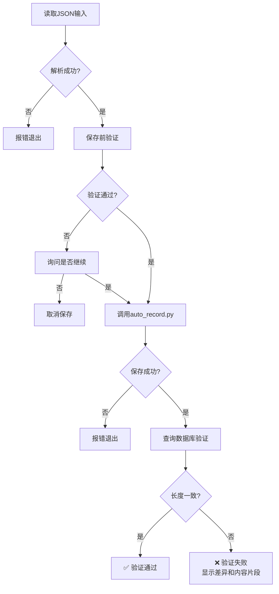

# 学习记录保存最佳实践指南

## 问题背景

**曾发生的问题:**
- 通过命令行参数传递大型JSON时,数据被Shell静默截断
- 脚本显示"保存成功",但数据库中实际只保存了占位符文本
- 缺乏端到端验证机制,导致虚假的成功反馈

**根本原因:**
1. Shell命令行有ARG_MAX限制(通常256KB,实际可用更小)
2. 没有验证数据库中实际保存的内容长度
3. 信任了脚本的输出消息而未做二次确认

---

## 解决方案: 三层防御体系

### 防御层1: 使用文件而非命令行参数

**❌ 错误做法:**
```bash
# 当JSON超过~50KB时会被截断
python3 auto_record.py '{"topic":"...", "insight":"8619字符..."}'
```

**✅ 正确做法:**
```bash
# 方式1: 从文件读取
python3 safe_save_log.py < /tmp/log_entry.json

# 方式2: 使用Python脚本直接调用API
python3 << 'PYEOF'
import json, requests
with open('/tmp/log_entry.json') as f:
    data = json.load(f)
requests.post("http://localhost:8002/api/entries", json=data)
PYEOF
```

---

### 防御层2: 保存前验证

`safe_save_log.py`会自动检查:

1. **必填字段完整性**
   - topic, insight, star_situation, star_task, star_action, star_result

2. **Insight长度合规性**
   - 必须≥2500字符
   - 不足时会警告并询问是否继续

3. **Diagram格式规范性**
   - 必须以`graph TD`、`flowchart TD`等开头

**示例输出:**
```
================================================================================
📋 数据验证报告:
================================================================================
  • ⚠️ 警告: insight长度仅1800字符,未达到2500字要求(当前:1800)
================================================================================

❌ 存在严重问题,是否继续保存? (y/N):
```

---

### 防御层3: 保存后端到端验证

脚本会自动查询数据库,对比"预期长度"vs"实际长度":

**验证通过的输出:**
```
📤 正在保存: AI时代代码质量确定性控制引擎战略定位
   Insight长度: 8619字符

✅ 灵感记录已保存: AI时代代码质量确定性控制引擎战略定位
   ID: 20
   研究类型: deep-research
   Insight长度: 8619字符

🔍 正在验证数据库中的实际内容...
   数据库记录:
   • ID: 20
   • 主题: AI时代代码质量确定性控制引擎战略定位...
   • Insight长度: 8619字符
   • 保存时间: 2026-04-08 18:27:08

✅ 验证通过! 数据库中insight长度(8619)与输入一致
```

**验证失败的输出:**
```
❌ 验证失败!
   预期长度: 8619字符
   实际长度: 16字符
   差异: 8603字符

⚠️ 可能存在数据截断,建议手动检查数据库

   实际保存的内容片段:
   深度分析内容超过2500字......
```

---

## 标准操作流程(SOP)

### 步骤1: 准备JSON文件

```bash
# 创建临时JSON文件
cat > /tmp/log_entry.json << 'EOF'
{
  "topic": "你的主题",
  "insight": "完整的深度分析内容(≥2500字)...",
  "diagram": "graph TD\n    A[开始] --> B[结束]",
  "code_snippet": "完整可运行代码...",
  "star_situation": "...",
  "star_task": "...",
  "star_action": "...",
  "star_result": "...",
  "topic_tag_id": "cn.dolphinmind.learning.log.tag.discipline.cs.ai.skill",
  "project_tag_id": null,
  "research_type": "deep-research",
  "energy_level": 5,
  "aha_moment": true
}
EOF
```

### 步骤2: 使用增强脚本保存

```bash
python3 /Users/mingxilv/learn/java-source-analyzer/dev-ops/script/safe_save_log.py < /tmp/log_entry.json
```

### 步骤3: 检查验证结果

- ✅ 如果看到"验证通过",说明保存成功
- ❌ 如果看到"验证失败",检查差异并重新保存

### 步骤4: 手动抽查(可选)

```bash
# 查询最新记录的insight长度
sqlite3 ~/learn/s-pay-mall-ddd/.lingma/learning-log/data/learning-log.db \
  "SELECT id, topic, LENGTH(insight), timestamp FROM learning_entries ORDER BY id DESC LIMIT 1;"
```

---

## 常见问题排查

### Q1: 为什么有时保存成功但验证失败?

**可能原因:**
1. Shell命令行参数被截断
2. 后端API对请求体大小有限制
3. 网络传输过程中数据丢失

**解决方法:**
- 始终使用文件输入而非命令行参数
- 检查后端日志: `tail -f /tmp/ll.log`

### Q2: Insight长度多少合适?

**建议:**
- 最低要求: 2500字符
- 推荐范围: 5000-10000字符
- 过短(<2500): 缺乏深度分析
- 过长(>15000): 可能包含冗余内容

### Q3: 如何批量验证历史记录?

```bash
# 检查所有记录的insight长度
sqlite3 ~/learn/s-pay-mall-ddd/.lingma/learning-log/data/learning-log.db \
  "SELECT id, topic, LENGTH(insight) as len FROM learning_entries WHERE len < 2500 ORDER BY len ASC;"
```

---

## 技术细节

### safe_save_log.py 工作原理



### 关键代码逻辑

```python
# 1. 保存前验证
if insight_length < 2500:
    print(f"⚠️ 警告: insight长度仅{insight_length}字符")
    
# 2. 调用原脚本保存
subprocess.run(['python3', AUTO_RECORD_SCRIPT, json_str])

# 3. 查询数据库验证
cursor.execute("SELECT LENGTH(insight) FROM learning_entries WHERE id=?", (saved_id,))
actual_len = cursor.fetchone()[0]

# 4. 对比验证
if actual_len == expected_len:
    print("✅ 验证通过!")
else:
    print(f"❌ 验证失败! 预期:{expected_len}, 实际:{actual_len}")
```

---

## 未来改进方向

### 短期(1周内)
- [ ] 在auto_record.py中内置验证逻辑
- [ ] 添加自动重试机制(检测到截断时自动切换为文件模式)
- [ ] 增加内容哈希校验(MD5对比)

### 中期(1个月内)
- [ ] 建立保存历史审计表
- [ ] 实现增量更新而非全量替换
- [ ] 添加Web界面用于查看和编辑记录

### 长期(3个月内)
- [ ] 集成到IDE插件,实现一键保存
- [ ] 支持版本控制和回滚
- [ ] 实现多人协作和评论功能

---

## 总结

**核心原则:**
1. **永远不要信任单一来源的成功消息** - 必须端到端验证
2. **大数据传输用文件而非命令行** - 避免Shell限制
3. **保存前后都要验证** - 预防胜于治疗

**记住:**
> "假执行比不执行更糟糕,因为它给你虚假的安全感。"

---

**最后更新:** 2026-04-08  
**维护者:** mingxilv
