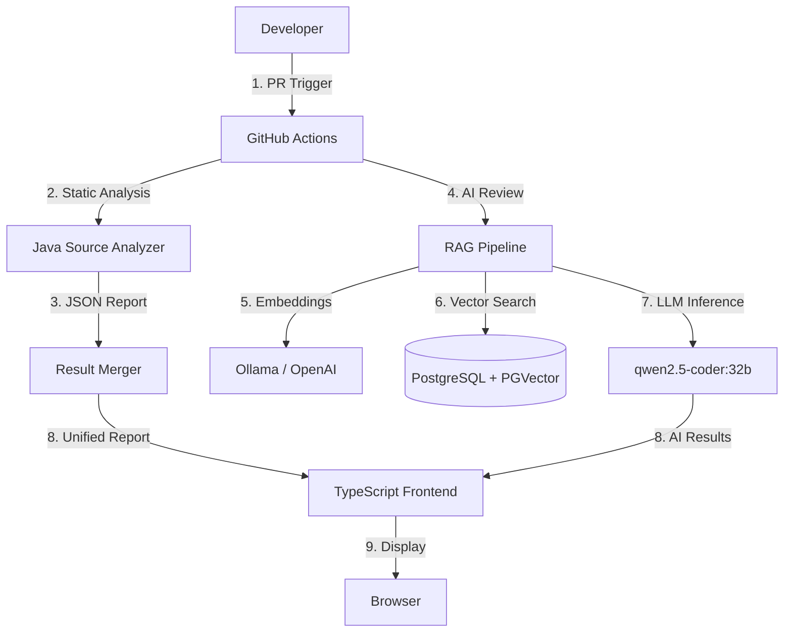

# Architecture Guide

## 1. System Overview

CodeGuardian AI is a hybrid **Static + AI** code review system. It combines traditional JavaParser AST analysis with RAG (Retrieval-Augmented Generation) powered by LLMs.

## 2. Component Diagram

## 3. Data Flow

1. **Ingestion**: GitHub Actions triggers `SourceUniversePro` on PR commits.
2. **Static Analysis**: JavaParser scans AST, generating `static-results.json`.
3. **RAG Retrieval**: `CodeSlicer` extracts relevant code blocks. `EmbeddingService` generates vectors (768d).
4. **Hybrid Search**: Vector Similarity (PGVector) + Keyword Match (BM25).
5. **LLM Generation**: `OpenAIChatClient` sends context to `qwen2.5-coder`.
6. **Merging**: `ResultMerger` aligns Static + AI results by `(filePath:line)`.
7. **Visualization**: `AiReviewView` renders unified report with confidence scores.

## 4. Technology Stack

| Layer | Technology | Purpose |
|-------|------------|---------|
| **Parser** | JavaParser 3.27.0 | Java AST Traversal |
| **Embedding** | Ollama (nomic-embed-text) | Text Vectorization |
| **Vector DB** | PostgreSQL 16 + PGVector | Similarity Search |
| **LLM** | qwen2.5-coder:32b | Code Review Generation |
| **Frontend** | TypeScript 5 + ECharts 5 | Visualization |
| **Migration** | Flyway 9.22.3 | Schema Versioning |

## 5. Security Architecture

- **Input Validation**: `SecurityUtils` prevents path traversal and arbitrary file read.
- **Secrets Management**: All secrets loaded from `.env` (never committed).
- **Dependency Updates**: PostgreSQL JDBC upgraded to fix CVE-2024-1597.
